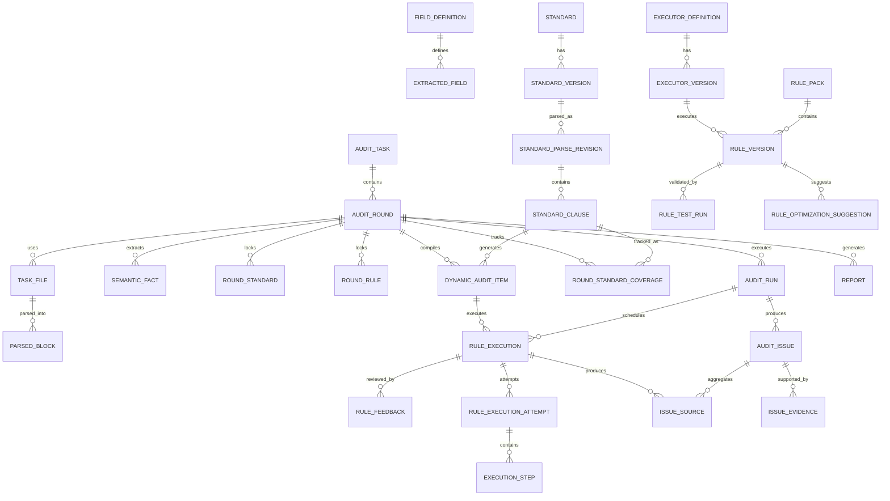

# 煤矿安标技术文档智能审核平台设计

## 1. 文档说明

| 项目 | 内容 |
|---|---|
| 文档版本 | 1.2 |
| 文档状态 | 第一版设计基线 |
| 本次更新 | 完善规则执行器管理、动态标准审核、调度一致性、反馈优化、字段单位体系和第一期实现边界 |
| 建设目标 | 在 MacBook Pro 上跑通可演示的完整审核流程，并可容器化部署到客户内网 |
| 目标读者 | 产品、研发、测试、实施、客户审核人员 |
| 设计取向 | 基础功能完整、规则有限可配置、AI结果可人工修订、暂不设计复杂审批和协同逻辑 |

本文档整合客户需求文件及前期澄清结果，作为第一版产品设计和技术实现依据。未明确事项按本文推荐方案实施，不再作为第一版启动阻塞项。

## 2. 项目背景与目标

煤矿安标审核机构需要审核企业提交的产品技术资料。一个审核任务对应一个产品和一个型号，常见资料包括：

- 企业标准或技术说明书
- 产品使用说明书
- 受控件明细表
- PDF 产品图纸
- 其他补充附件

系统需要结合文件中引用的国标、行标、实施规则，以及平台推荐并由审核人员确认的适用标准，对资料进行完整性、规范性、标准符合性、技术参数、跨文件一致性和受控件专项审核，最终形成审核意见单或正式审核报告。

第一版的核心目标不是替代专家，而是完成以下闭环：

```text
上传资料 -> 自动解析 -> 确认适用标准 -> AI初审
-> 人工复核和修订 -> 多轮整改 -> 发布报告 -> 全程追溯
```

## 3. 建设原则

1. 不限制煤矿设备类别，不要求用户配置产品类别。
2. 一个主任务只审核一个产品的一个型号。
3. 产品名称、型号和客户名称由系统从文件中提取，人工确认。
4. 标准和审核规则分开管理；标准原文是依据，规则是判断方法。
5. 第一版不要求专家将每条标准手工编成规则，标准符合性主要由条款检索和大模型动态判断。
6. 确定性问题优先由规则引擎判断，语义问题由大模型判断。
7. AI只生成建议，审核人员拥有问题和结论的最终决定权。
8. 所有问题必须尽量关联客户文件证据和标准条款证据。
9. 第一版优先可演示、可理解和可维护，不引入多租户、复杂审批和微服务治理。
10. 历史审核必须可复现，标准、规则、模型和提示模板均保存版本快照。

## 4. 第一版范围

### 4.1 支持的文件

- PDF
- DOC、DOCX
- XLS、XLSX
- JPG、PNG
- ZIP 压缩包

ZIP 由系统自动解压并逐文件识别。单文件至少支持 50MB。

### 4.2 PDF 图纸能力

第一版提取并审核：

- 技术要求
- 技术参数表或技术特征表
- 标题栏
- 零件明细表
- 图纸中的标准引用
- 上述内容所在页码和区域坐标

第一版不判断装配图形、几何结构、尺寸链、安全结构和图形构件差异，不解析 DWG 原生图元。图纸尺寸文字可作为参数参与一致性比较，但不判断几何合理性。

### 4.3 第一版不包含

- 现有任务网站集成
- 邮件、短信和微信服务号
- 电子签名和电子印章
- 外部安标证书真实性查询
- 多人同时编辑、会签和复杂审批
- 多机构和多租户
- 任意脚本或完整低代码规则平台
- 自动备份、灾备和跨机房高可用
- 权威标准网站自动联网查询
- 专家标注数据驱动的准确率验收

## 5. 用户与权限

### 5.1 审核人员

- 上传资料并创建任务
- 确认客户名称、产品名称、产品型号
- 增删任务适用标准并选择版本
- 启动完整自动审核
- 确认、修改、驳回和新增审核问题
- 调整非强制规则的任务级参数或停用状态
- 查看本轮规则装配清单、动态审核项和标准覆盖状态
- 确认受影响结果后执行局部重跑或单规则重跑
- 发起整改和新一轮审核
- 确认结论并发布报告
- 查看本人负责的任务和报告

### 5.2 管理员

管理员拥有审核人员的全部权限，并可以：

- 创建、启用和停用账号
- 查看、转交全部任务
- 维护标准、标准版本、条款和标准关系
- 维护规则、规则版本和 AI 审核策略
- 查看执行器目录和版本，发布、弃用、暂停、封禁或恢复执行器版本
- 维护规则包、核心字段、单位别名和规则优化建议
- 暂停恢复队列、重试失败作业并查看执行链路和系统内告警
- 配置模型供应商、模型和密钥
- 维护问题分类、报告模板和系统参数
- 查看审计日志和运行状态

第一版使用本地账号密码。管理员可直接发布标准和规则，不设置双人审批。所有发布和修改操作留痕。

## 6. 产品功能架构

第一版设置六个一级模块。

### 6.1 工作台

工作台提供审核人员的统一入口：

- 新建审核任务
- 我的待处理任务
- 文件解析中和自动审核中的任务
- 待确认基本信息和标准的任务
- 待人工复核的任务
- 待发布报告
- 处理失败任务
- 最近操作记录

管理员额外看到全部任务数量、标准待校对数量、任务失败数量和模型调用异常。

### 6.2 审核任务

#### 6.2.1 任务列表

支持按以下条件查询：

- 任务编号
- 客户名称
- 产品名称
- 产品型号
- 审核人员

列表展示任务编号、客户、产品、型号、当前轮次、负责人、状态、结论和更新时间。审核人员只看自己负责的任务，管理员可以查看和转交全部任务。

#### 6.2.2 创建任务

审核人员直接上传文件创建任务，不要求预填业务表单。系统生成临时任务编号并开始解析。上传区支持批量拖放、进度显示、失败重试和 ZIP 自动解压。

#### 6.2.3 任务详情

任务详情采用标签页：

- 概览：基本信息、当前状态、适用标准、问题统计和结论
- 文件：文件分类、解析状态、版本和在线预览
- 标准：识别、推荐、人工增删和本轮标准快照
- 规则与范围：本轮规则装配清单、动态审核项、任务级参数覆盖和标准覆盖清单
- 审核结果：问题列表、原文定位和人工复核
- 运行记录：审核节点、规则执行、重试、局部重跑和异常处置
- 审核轮次：历次文件、问题、结论和整改状态
- 报告：审核意见单和正式报告版本
- 操作记录：状态变化和关键人工操作

#### 6.2.4 文件管理

系统自动识别企业标准、使用说明书、受控件明细表、PDF 图纸、标准文件、其他附件和无法识别文件。审核人员可以修改文件类型、替换文件、补充文件、删除误传文件或标记为不适用。

文件无法解析时可重试、替换，或选择“无法解析但继续”。受影响审核项进入“无法判断”，不能自动判定通过。

### 6.3 标准库

标准库统一管理国标、行标、实施规则和其他管理规则，提供：

- 标准列表和全文检索
- 批量上传和解析队列
- 原文、目录和条款校对
- 标准版本和有效状态
- 新旧版本比较
- 替代、引用和配套关系
- 标准在审核任务中的使用记录
- 临时标准转正式标准

### 6.4 审核规则

规则模块提供：

- 规则列表、类型、状态和版本
- 执行器目录、版本、参数 Schema、运行状态和引用关系
- 规则包、审核阶段和文件数据触发条件
- 规则参数、默认严重等级和适用文件
- 强制规则标记
- 规则启用、停用、复制和发布
- AI 审核策略模板
- 使用历史任务进行试运行
- 新旧规则结果比较
- 命中次数、人工确认率和驳回率统计
- 人工反馈原因统计和规则优化建议

第一版只允许基于平台预置执行器进行配置，不支持管理员编写任意代码。

### 6.5 报告与档案

- 查看历次审核意见单和正式报告
- 在线查看报告
- 下载 Word 或 PDF
- 查看报告对应的任务、轮次、文件、标准和规则快照
- 历史任务按照任务编号、客户名称、产品名称、产品型号、审核人员查询

### 6.6 系统管理

- 用户管理
- 模型供应商和模型配置
- 问题分类管理
- 报告模板管理
- 通用参数管理
- 核心字段和单位别名管理
- 审计日志
- 异步队列、Worker、规则执行和模型调用状态
- 系统内运行告警

## 7. 核心业务流程

### 7.1 首轮审核

```text
上传文件
-> 创建任务
-> 文件自动分类和解析
-> 提取客户、产品、型号和引用标准
-> 检查资料完整性和解析质量
-> 审核人员确认基本信息
-> 审核人员增删并确认适用标准
-> 锁定标准、规则、模型和提示模板快照
-> 执行完整审核
-> 审核人员复核问题和建议结论
-> 生成审核意见单或正式报告
-> 发布或进入整改
```

完整审核前只有两个强制人工确认点：

1. 客户名称、产品名称和产品型号。
2. 本轮适用标准及版本。

### 7.2 资料不完整

系统提示缺失、重复、无法识别和解析失败文件。审核人员可以补充资料、修改文件类型、标记不适用、暂停任务或带缺失项继续。

带缺失项继续时，报告列出缺失资料、无法完成的审核范围和“无法判断”项。是否采用“资料不完整无法判断”作为最终结论，由审核人员确认。

### 7.3 多轮整改

系统采用“主任务 + 审核轮次”：

```text
主任务
  |- 第1轮首次审核
  |- 第2轮整改复核
  |- 第3轮再次整改
  `- 最终轮正式报告
```

新一轮自动识别新增、替换、删除和未变化文件。未变化文件复用解析结果，变化文件重新解析。上一轮问题标记为已解决、未解决、部分解决、无法判断或本轮不再适用，同时识别本轮新增问题。

每轮保存独立的文件、标准、规则、模型、问题和报告快照。主任务展示完整时间线。

### 7.4 状态机

```text
草稿 -> 文件解析中 -> 待确认基本信息和标准
-> 自动审核中 -> 待人工复核 -> 待发布
-> 已发布 -> 待整改 -> 新一轮审核 -> 已完成
```

异常进入“处理失败”，可以重试；误创建任务可以作废。所有状态变化保存操作人、时间和原因。

## 8. 标准管理设计

### 8.1 标准数据结构

```text
标准主档，例如 GB/T 10595
  |- 2017版本
  |    |- 原始文件
  |    |- 章节和条款
  |    |- 表格、公式、图片和附录
  |    `- 关键词与向量索引
  `- 历史版本及替代关系
```

标准主档保存类型、编号主体、名称、别名、关键词和适用范围。标准版本保存完整编号、发布日期、实施日期、废止日期、发布机构、强制性、原始文件和状态。

条款保存编号、标题、原文、层级、条款类型、约束等级、参数结构、页码、坐标、截图、置信度和校对状态。

条款约束等级包括必须、禁止、推荐、许可、描述性和待确认。系统根据“应、必须、不得、严禁、宜、可”等词自动识别，管理员可修正。

### 8.2 导入和发布

```text
上传标准
-> 文件哈希和编号查重
-> 识别编号、名称、版本和日期
-> 文字提取或OCR
-> 章节、条款、表格、公式、图片和附录解析
-> 管理员校对
-> 发布检查
-> 发布有效版本
-> 构建关键词和向量索引
```

标准状态为草稿、解析中、待校对、待发布、有效、即将废止、已废止。未发布且未被引用的草稿可以删除；已发布或被任务引用的版本只能停用或废止，不能物理删除或覆盖。

### 8.3 版本比较

上传同一标准的新版本时，自动识别：

- 新增、删除和修改的章节及文本条款
- 表格行、列和单元格变化
- 图片和复杂公式发生变化的页面
- 可能受影响的审核规则和审核项

管理员可以修正差异结果。历史任务保持原版本快照；新轮次选择升级时提示变化和重新审核范围。

### 8.4 与审核流程对接

客户文件解析后，从封面、引用文件、技术要求、表格和图纸文字中提取标准编号和名称。系统规范化空格、连接符、大小写和年代号，再按以下顺序匹配：

1. 完整编号精确匹配。
2. 规范化编号匹配。
3. 编号主体和年代匹配。
4. 名称及别名匹配。

系统区分精确匹配、编号名称不一致、引用废止版本、未注明年代和标准库缺失。

除文档明确引用的标准外，系统根据产品名称、型号、用途、工作环境、参数和关键术语推荐可能适用但未引用的标准。推荐标准只有经审核人员确认后才能进入审核依据。

标准库缺失时，审核人员可以临时上传、跳过或等待管理员补充。临时标准只属于当前任务，之后由管理员决定是否收录。跳过标准必须记录原因并在报告中说明影响范围。

确认后生成本轮标准快照。完整审核只在快照范围内检索条款，找不到充分依据时输出“无法判断”，不得仅凭模型常识判定不合格。

### 8.5 标准条款解析修订版

标准原文版本和条款结构化解析结果分别版本化。标准编号和原始文件未变化，但管理员修正条款拆分、约束等级、参数单位、适用条件、表格关联或原子审核项时，必须生成新的解析修订版，不得覆盖已经发布和被审核轮次引用的解析数据。

```text
标准原文版本 MT/T 820-2023
  |- 解析修订 P1
  |- 解析修订 P2
  `- 解析修订 P3
```

解析修订版状态包括草稿、校对中、已发布和已归档。新修订版发布后仅供新审核轮次选择，正在执行和已经完成的轮次继续使用原修订版。发起新一轮时检测更新，默认沿用上一轮解析修订版，审核人员可以升级并重新编译受影响的动态审核项。

每次修改标记为“无审核影响”或“有审核影响”。错别字等不改变语义的修正可以标记为无审核影响，但仍保留变更记录；影响条款语义、适用条件、参数或原子拆分的修改必须执行影响分析，列出可能受影响的规则、动态审核项和标准覆盖状态。

本轮标准快照同时保存标准原文版本和解析修订版，确保历史审核可以完整复现。

## 9. 规则管理设计

### 9.1 三类规则

#### 确定性规则

处理非空、格式、日期、单位、数值范围、字段一致性和标准有效性等稳定判断。

#### 标准条款动态规则

系统从本轮标准条款中识别适用条件、参数、单位和约束，动态形成任务级审核指令，不要求管理员逐条编写表达式。

#### AI 审核策略

约束大模型的审核目标、文档关注点、条款匹配、证据要求、问题分类、严重等级、无法判断条件和结构化输出格式。

### 9.2 规则、执行器、规则包和流程的边界

系统将判断能力分为四层：

```text
审核流程编排
  -> 规则包和审核阶段
  -> 规则定义及规则版本
  -> 规则执行器及执行器版本
```

- 规则执行器是研发实现并注册的程序能力，例如非空、正则、日期、数值和语义比较。
- 规则是执行器的业务实例，由管理员选择执行器并配置参数、适用范围、严重等级和启停状态。
- 规则包是相关规则的逻辑集合，例如资料完整性、跨文件一致性和受控件专项。
- 审核流程编排决定各规则包的执行阶段、依赖和并发关系，第一版由系统固定，不提供任意可视化编排。

管理员可以查看执行器及其参数说明、使用情况和运行指标，但不能在线修改或上传执行器代码。新增执行器、修复执行器缺陷或升级运行逻辑由研发完成。第一版不执行管理员上传的脚本。

### 9.3 第一版规则执行器

| 执行器 | 作用 | 主要参数 |
|---|---|---|
| required_field | 字段或内容非空 | 字段、问题分类、严重等级 |
| regex_format | 编号、证号、单位格式 | 正则表达式 |
| date_validity | 有效期检查 | 基准日期、剩余月数 |
| exact_compare | 精确一致性 | 来源字段、目标字段 |
| normalized_compare | 去空格、大小写等归一化比较 | 归一化方式 |
| numeric_compare | 数值上下限比较 | 运算符、阈值、单位 |
| standard_status | 标准有效性检查 | 允许的标准状态 |
| semantic_compare | 语义一致性或符合性 | 提示模板、置信度阈值 |
| evidence_required | 无依据转人工 | 最少证据数量、阈值 |

新增复杂能力时由研发增加执行器，管理员再基于执行器创建规则实例。

每个执行器注册编码、名称、版本、输入类型、适用数据范围、参数 JSON Schema、结果 Schema、默认超时、是否支持批量、运行方式和启停状态。管理界面展示执行器引用规则、近期执行次数、成功率、异常率和平均耗时。

执行器版本运行状态为已发布、已弃用、已暂停和已封禁。已弃用用于正常升级，新轮次不再默认选择，但已有快照允许继续执行；已暂停用于临时故障，不调度新执行，等待作业保持等待，恢复后继续；已封禁用于严重逻辑错误或安全风险，取消尚未执行的作业、尝试终止运行作业，并将尚未人工确认的结果标记为不可用。已发布报告和已经人工确认的历史结果不删除，但档案显示风险提示和封禁原因。

规则参数使用 JSON Schema 校验。示例：

```json
{
  "code": "CONTROLLED_PART_CERT_VALIDITY",
  "name": "受控件安标证剩余有效期",
  "executor": "date_validity",
  "scope": ["controlled_parts_list"],
  "parameters": {
    "date_field": "certificate_expiry_date",
    "base_date": "round_review_date",
    "minimum_remaining_months": 6
  },
  "issue_category": "受控件",
  "severity": "一般",
  "mandatory": false,
  "affects_suggested_conclusion": true
}
```

每次规则执行统一返回：规则版本、执行器版本、输入字段、归一化值、执行结果、问题描述、客户证据、标准证据、置信度、建议等级、是否影响建议结论和执行时间。未命中、通过、不通过、无法判断和执行异常必须明确区分。“无法判断”是业务结果，“执行异常”是技术故障。

### 9.4 规则字段与生命周期

规则保存编码、名称、类型、适用文件、检查目标、执行器、参数、默认问题分类、默认严重等级、是否影响建议结论、是否强制、优先级和版本。

状态为草稿、测试中、已发布、已停用和已归档。已被审核引用的规则版本不可修改，只能复制生成新版本。

规则发布前必须通过参数校验和试运行。已发布规则不能原地修改，只能复制形成新版本。规则可以配置所属阶段、优先级、前置依赖、是否强制、是否允许任务级覆盖以及是否影响建议结论。

### 9.5 三层规则装配机制

系统不依赖产品类别选择规则，而是根据任务资料和确认标准进行三层装配：

1. 全局基础规则：所有任务默认启用，例如资料完整性、产品名称型号非空和标准引用有效性。
2. 文件与数据触发规则：根据上传文件、解析块和抽取实体启用。例如存在受控件明细表时启用受控件规则；存在 PDF 图纸时启用标题栏、参数表和零件明细表规则；提取到安标证号时启用证号格式和有效期规则；多个文件包含相同字段时启用跨文件一致性规则。
3. 标准动态规则：审核人员确认适用标准后，系统检索相关条款、识别适用条件和约束，再选择确定性比较或 AI 语义执行器形成本轮审核项。

审核启动前生成“本轮规则清单”，展示规则来源、启用原因、执行阶段、参数和强制状态。审核人员可以停用非强制规则并填写原因、调整允许覆盖的参数或手动补充规则；强制规则只能查看，不能停用。

### 9.6 任务级调整和局部重跑

审核人员可以查看本轮规则、修改允许覆盖的参数、停用非强制规则并填写原因。强制规则不可停用。调整只影响当前轮次并进入审计日志。

审核人员修改抽取字段、文件类型、文件版本、适用标准或可覆盖规则参数后，系统先执行影响分析，不立即自动重跑。界面提示“有 N 项审核结果可能受影响”，列出受影响规则、问题和预计调用模型范围，由审核人员确认后执行局部重跑。

局部重跑期间，原结果继续保留并标记“可能已失效”。新结果完成后与旧结果自动比较；未受影响问题保持原人工复核状态；已经人工修改的问题不得被新结果直接覆盖，必须由审核人员比较确认。重跑原因、输入差异、影响范围、新旧结果和操作人全部进入审计日志。

系统支持整轮执行、局部重跑和单规则手动重跑。解析结果可以复用时不重复执行 OCR 和版面解析。

### 9.7 跨轮次版本策略

- 首轮审核使用生成审核快照时的已发布规则、执行器和 AI 策略版本。
- 同一轮次内无论完整重跑、局部重跑或单规则重跑多少次，均保持版本不变。
- 发起新一轮时检测规则、执行器和 AI 策略更新，默认沿用上一轮版本，保证结果可比较。
- 审核人员可以升级到最新已发布版本；升级前展示变更内容、影响规则和预计重新审核范围。
- 管理员可以将安全修复标记为强制升级，新轮次必须采用指定版本。
- 历史轮次始终保留原版本快照，后续升级不得改变历史结果。

### 9.8 第一版预置规则包

- 资料完整性
- 文件格式与编制规范
- 产品名称和型号一致性
- 标准引用和有效性
- 技术参数抽取与比较
- 跨文件一致性
- 受控件专项
- PDF 图纸文字和表格
- 低置信度和无法判断转人工

### 9.9 标准条款动态审核项

系统不要求管理员将每条国标、行标手工编制为永久规则，而是在具体审核轮次中将相关标准条款编译为“本轮动态审核项”。动态审核项与管理员维护的规则版本分开管理，但共用规则执行记录、证据结构、问题聚合和人工复核机制。

标准入库阶段只进行与具体产品无关的结构化解析，包括章节条款拆分、表格公式和附录关联、约束等级识别，以及审核对象、适用条件、运算关系、参数类型和单位提取。管理员校对后随标准版本发布。

任务审核阶段结合本轮标准快照、客户文件、抽取字段和条款适用条件进行动态编译：

```text
本轮标准条款 + 客户审核对象 + 文件和抽取数据
-> 条款相关性检索
-> 适用条件判断
-> 动态审核项
-> 选择确定性执行器、AI 语义执行器或转人工
```

动态审核项记录来源标准及版本、来源条款、客户审核对象、适用条件、执行方式、输入字段、客户证据、标准证据、执行器或 AI 策略版本、系统结果和人工结果。动态审核项必须持久化并进入本轮快照，不能在执行后丢弃。

标准条款包含多个独立要求时，系统应拆分为原子审核项执行，并保留父条款关系。例如同一条款中的驱动功率、保护装置和故障报警要求分别形成独立审核项。每个原子审核项具有独立审核对象、适用条件、运算关系、客户证据、执行方式、系统结果和人工结论；界面和报告可以按父条款聚合展示。

条款无法可靠拆分时保留整条作为语义审核项，并标记“未完成原子化”，由 AI 整体判断或转人工处理。系统不得为了拆分数量而改变原条款语义，原子审核项始终保留到标准原文的可追溯关系。

适用状态包括：适用、不适用、适用性不确定、当前版本不支持和缺少资料无法执行。不适用条款不生成问题，但保留过滤原因；涉及图形结构等第一版不支持的条款标记为“当前版本不支持”；缺少客户资料时标记“缺少资料无法执行”。

执行方式分为：

- 确定性比较：适用于数值范围、枚举、单位、数量、日期、格式和字段一致性。
- AI 语义判断：适用于安全要求、设计说明、操作要求和描述性符合性，必须输出客户证据、标准证据和判断理由。
- 人工判断：适用于复杂公式参数不足、适用条件不明确、需要判断图形结构、条款解析置信度低或标准之间存在冲突的情况。

高置信度且适用条件明确的动态审核项直接进入执行，不要求审核人员逐条确认。适用性不确定的项目集中进入“待确认审核范围”；审核人员可以排除、补充或修正审核项。强制条款被排除时必须填写原因。系统判定为不适用的条款默认折叠，但可以在标准快照中查询。

### 9.10 执行器和规则测试发布门槛

执行器和规则发布采用三级测试门槛，但第一版仍由管理员单人发布，不增加双人审批。

1. 执行器代码测试：研发随代码提供单元测试、参数边界、单位归一化、异常输入、超时、输出大小、统一结果协议、幂等性和 ARM64/AMD64 兼容测试。未通过自动化测试的执行器版本不能进入正式 Worker 镜像。
2. 规则配置测试：系统校验执行器版本、参数 JSON Schema、字段和文件范围、依赖循环、强制规则结论影响策略、问题分类等级和统一输出结构。配置校验失败的规则不能进入测试中状态。
3. 任务试运行：使用历史客户资料或系统内置演示资料执行候选规则版本，不修改原任务和历史问题，并与当前发布版本比较新增问题、消失问题、等级变化、证据变化、异常数量、耗时和模型调用量。

当前没有专家标注样本，第一版不设置准确率硬门槛，但规则发布前必须满足：没有未处置执行异常；没有结构校验失败；“不符合”问题必须关联客户证据和标准依据；耗时和模型调用量不超过配置上限；强制规则通过系统内置测试样例。

AI 执行器对同一测试样例默认执行三次，比较结构化输出成功率、结论一致性、证据定位一致性、问题描述差异、Token 和耗时。第一版展示差异供管理员判断，未来有专家样本后增加漏检率、误报率和自动回归门槛。

规则发布后只影响新审核轮次。发现问题时停用该版本并发布修复版本，不自动改变已经生成快照的轮次；尚未启动审核的新轮次可以重新生成规则快照。系统保留测试记录、试运行输入范围、差异摘要、发布人和发布时间。

### 9.11 人工反馈和规则优化闭环

系统记录人工确认、驳回、问题描述修改、分类修改、等级修改、证据补充或替换、人工新增问题和最终结论修改等结构化反馈。驳回或修改原因包括客户证据识别错误、标准条款不适用、适用条件判断错误、参数单位解析错误、重复问题、等级不合理、证据不足、AI 判断错误、规则配置不合理和其他。

管理员可以查看高驳回率规则、频繁修改等级的规则、经常缺少证据的规则、无法判断比例过高的动态审核项、审核人员频繁新增的问题类型、执行器在不同规则中的表现以及规则版本发布前后的变化。

达到配置阈值时系统仅生成优化建议，不自动停用或修改规则。例如最近二十次命中中驳回比例超过百分之三十时，提示管理员检查适用条件、证据阈值或规则参数。管理员可以从优化建议创建新的规则草稿版本，但仍须完成参数修改、配置校验、历史资料试运行、差异确认和正式发布。

人工新增问题不得直接转成全局规则。管理员可以聚合相似人工问题后，决定创建确定性规则、AI 策略或继续保留人工审核。第一版不根据人工反馈自动训练模型、修改提示模板、修改标准条款或发布规则。

### 9.12 组合执行器

组合执行器只用于完成一个逻辑审核判断的多个技术步骤，例如参数定位、取值、单位归一化、标准要求解析、数值比较和证据组装。多个独立业务要求仍拆分为多个原子审核项，不能用一个组合执行器打包多个问题。

组合步骤分为必需步骤、可降级步骤和条件步骤。必需步骤失败时整体进入执行异常或无法判断，不得生成不符合结论；可降级步骤失败时允许主判断继续，但结果标记“成功但降级”并显示缺失能力；条件步骤在条件不满足时跳过，不视为异常。

每个步骤记录编码、输入输出类型、输入哈希、状态、执行器版本、起止时间、异常、重试和结果复用情况。重试从失败步骤继续，只有输入哈希未变化时才能复用前序成功结果；输入变化时从第一个受影响步骤重新执行。

组合执行器最终状态为成功、成功但降级、无法判断、执行异常和已取消。第一版组合流程由研发在代码中定义并版本化，管理员只能查看步骤和配置开放参数，不能拖拽、增加任意节点或调整步骤顺序。

### 9.13 第一期实现边界

为保证基础演示闭环可在合理周期内完成，规则执行体系按以下边界实施。

第一期必须完成：内置执行器注册和只读目录；规则参数配置、版本和发布；固定审核阶段；三层规则装配；任务规则和执行器快照；标准动态审核项；统一执行结果和证据；问题聚合；整轮执行和确认式局部重跑；不可变执行尝试；基础覆盖清单；任务内执行进度和失败重试。

第一期简化实现：规则包只配置所属固定阶段和成员，不支持任意依赖编排；组合执行器只实现演示所需的一到两个代码内流程；规则优化只展示基础人工反馈统计，不自动生成复杂参数建议；运行监控使用数据库统计和系统内状态页；执行器暂停和封禁提供基本操作，不实现跨节点复杂调度治理。

第一期明确不做：管理员脚本、在线插件安装、热加载、可视化 DAG、自动学习和自动发布、复杂灰度和回滚、跨机构规则共享、Prometheus/Grafana 和分布式链路追踪平台。

## 10. 文件解析与数据抽取

### 10.1 处理流水线

```text
安全检查 -> 文件类型识别 -> 文本提取 -> OCR兜底
-> 版面与章节识别 -> 表格还原 -> 字段抽取
-> 原文定位和截图 -> 统一结构化数据
```

带文本层 PDF 优先读取原文字层；扫描件使用内网 OCR；复杂表格、图纸标题栏和低质量页面调用外部多模态模型兜底。所有结果保留页码、坐标和置信度。

### 10.2 文件类型抽取重点

| 文件类型 | 重点抽取内容 |
|---|---|
| 企业标准/技术说明书 | 标准编号、产品名称型号、引用标准、技术参数、安全要求、检验方法 |
| 使用说明书 | 产品名称型号、参数、工作环境、安装维护、警示语、安全要求、引用标准 |
| 受控件明细表 | 名称、规格型号、生产单位、安标证号、有效期、受控类别 |
| PDF 图纸 | 技术要求、参数表、标题栏、零件明细表、引用标准 |

系统不要求审核人员在审核前逐项确认全部抽取结果。审核人员在结果页修正关键抽取错误，系统只重新执行受影响的审核项。

### 10.3 统一字段目录和任务级语义事实

规则不得直接引用文件解析结果中的临时 JSON 路径。系统采用“稳定核心字段目录 + 开放任务级语义事实”的双层数据模型。

核心字段目录管理跨产品稳定字段，例如产品名称、产品型号、客户名称、标准引用、文件类型、安标证号和有效期、受控件名称型号和类别、图纸标题和型号。字段定义包含编码、名称、数据类型、多值属性、单位维度、适用文件、别名、规范化方式、校验方式和是否允许人工修改。

确定性规则只能引用已经注册的字段编码。管理员可以查看字段、增加别名、调整显示名称、配置单位换算和格式校验，以及创建新的语义字段定义；已经被规则引用的字段编码和数据类型不得原地修改，需要变更时创建新版本并执行影响分析。

产品专用技术参数使用任务级语义事实表示，不要求预先穷举产品类别。语义事实保存概念、原始值、规范化值、单位、数量、上下文、文件版本、页码章节、表格单元格或坐标、提取方式、置信度和人工修正。例如“驱动功率”“电机功率”“配套功率”可以在当前任务中归一化为同一语义概念。

执行器声明支持的数据类型、单位维度和多值能力。管理员配置规则时，界面只允许选择与执行器输入协议兼容的字段或语义事实，避免将日期字段配置给数值比较执行器等无效组合。

### 10.4 数值、单位、范围和公差

技术参数采用结构化数值表达，不将所有参数简化为单一数字。支持标量、数量组合、区间、下限、上限、目标值及公差、枚举集合、比值和单位未知等类型。结构化结果同时保存原始文本、值类型、数量、数值、原单位、单位维度、标准值、标准单位、来源和置信度。

单位换算使用成熟单位库实现，不自行维护全部换算公式。系统保存原单位和标准单位，只有单位维度一致时才能比较。管理员可以维护大小写和中文单位别名，但不能在线编写任意换算公式；新增单位维度和换算能力由研发实现并测试。

单位可以来自数值文本、表格列标题、参数名称、图纸标题栏或标准条款上下文。继承表头或上下文单位时必须记录来源和置信度；单位无法可靠推断时不得直接进行数值符合性判断。

数值比较规则明确运算符、区间边界、绝对或相对公差、小数位、舍入方式、数量组合比较方式和是否允许单位换算。对于 `2×75 kW`，比较总功率时可以与 `150 kW` 比较，比较单机功率时必须分别比较数量和单机值，规则不得隐式选择比较语义。

数值单位缺失、OCR 字符歧义、范围边界不清、数量组合与尺寸无法区分、舍入边界缺少公差依据或换算后仍存在精度冲突时，结果转为无法判断或人工确认，不得强行进行数值判断。

## 11. 智能审核编排

第一版使用可观测的工作流节点，而不是让多个自治智能体自由讨论。每个节点输入输出结构固定，失败可重试。

### 11.1 工作流节点

1. 文件分类与解析节点：识别文件类型并产生页面、段落、表格和坐标数据。
2. 基本信息节点：提取客户、产品和型号候选值及来源。
3. 标准识别节点：提取引用标准并推荐潜在适用标准。
4. 条款检索节点：从本轮标准快照中为审核对象检索相关条款。
5. 单文件审核节点：分别审核企标、说明书、受控件表和图纸文字表格。
6. 跨文件一致性节点：比较名称、型号、标准和技术参数。
7. 受控件专项节点：检查名称、型号、生产单位、证号、有效期和类别依据。
8. 问题汇总节点：合并重复问题、检测规则冲突并生成建议严重等级。
9. 结论建议节点：根据资料完整性和未关闭问题生成建议结论。
10. 报告生成节点：将人工确认后的结果生成审核意见单或正式报告。

### 11.2 规则调度机制

规则按照资料解析、基本信息和标准识别、资料完整性、单文件审核、跨文件一致性、标准条款符合性、受控件专项、问题汇总和结论建议的阶段顺序调度。规则声明前置依赖和输出，只有依赖满足后才能进入执行队列。

```text
待调度 -> 等待依赖 -> 执行中
  -> 未命中 / 通过 / 不通过 / 无法判断
  -> 执行异常 / 已取消
```

同一任务内相互独立的文件规则可以并行；跨文件规则等待相关文件解析完成；标准动态规则等待本轮标准快照确认；AI 调用使用独立队列和并发限制。确定性执行器异常默认重试两次，AI 执行异常按模型网关策略重试或切换备用模型。非关键规则异常不阻塞整个任务；影响结论的强制规则异常时，任务进入“需人工处理”。

### 11.3 执行幂等、重试、过期和取消

规则执行采用“逻辑执行 + 不可变执行尝试”模型。`RuleExecution` 表示一次逻辑审核，技术重试、备用模型切换和人工强制重跑分别创建新的执行尝试记录，不覆盖前一次输入输出和异常。

逻辑执行幂等键由审核轮次快照、规则或动态审核项版本、执行器版本、规范化输入哈希和执行模式组成。同一幂等键已经成功时，重复调度复用成功结果，不重复调用模型和生成问题；人工选择“强制重新执行”时创建新的执行代次，不复用原结果。

执行期间文件、字段、标准或规则参数发生变化时，作业完成后必须比较输入快照版本。输入已经变化的结果标记为“已过期”，不得进入当前问题汇总；旧结果继续保留用于追溯，新输入经影响分析和审核人员确认后创建新执行。

重试策略如下：

- 确定性执行器技术异常自动重试两次。
- AI 执行器按模型网关策略重试，必要时切换备用模型。
- 参数错误、输入缺失等业务错误不自动重试。
- 每次尝试记录执行器、模型、耗时、Token、异常和输入输出摘要。
- 超过重试次数后进入执行异常，由审核人员重试、跳过或说明。

等待调度和等待依赖的作业可以立即取消；正在执行的本地作业尝试终止；已经发送到外部模型且无法撤回的请求在返回后标记为已取消，不进入业务结果。取消审核不删除已经完成的执行记录，局部重跑只取消受影响且尚未完成的旧作业。

第一版设置三档队列优先级：人工触发的单规则或局部重跑优先，其次为正常完整审核，最后为标准重新解析、历史试运行和统计任务。同一优先级按先进先出处理，并限制单个审核任务占用的并发数。

### 11.4 条款符合性判断

```text
客户章节、参数或表格
-> 在标准快照中关键词和向量混合检索
-> 相关性重排
-> 提取条款约束及适用条件
-> 确定性比较或AI语义判断
-> 输出客户证据 + 标准证据 + 结论 + 置信度
```

违反必须或禁止条款时默认建议为严重；不满足推荐条款时默认建议为一般或提示。审核人员可以调整。

#### 证据充分性和结果边界

动态审核项必须先确定客户证据和标准证据的充分性，再生成符合性结果。系统严格区分找到证据且符合、找到证据且不符合、证据不足、未找到客户证据、未找到标准依据和文件解析失败，不能将“未找到”直接等同于“不符合”。

| 客户证据 | 标准证据 | 建议结果 |
|---|---|---|
| 充分 | 充分 | 执行符合性判断 |
| 缺失 | 充分，且条款明确要求资料必须包含 | 资料缺失或不符合 |
| 缺失 | 充分，但无法确认资料中是否必须出现 | 无法判断 |
| 充分 | 缺失 | 无法判断，不使用模型常识判错 |
| 文件解析失败 | 任意 | 无法判断，并说明解析范围受限 |
| 存在但相互冲突 | 充分 | 转人工确认 |

证据记录文件及版本、页码、章节或表格位置、坐标、截图、原文、结构化值和单位、提取方式、置信度以及人工确认状态。

对于“资料应包含某项内容”的要求，系统只有在完成配置范围内的全文、表格和图纸文字检索后，才能输出“未找到”。报告应明确表述检索范围，例如“在本轮提交的企业标准、使用说明书和图纸文字区域中未检索到相关内容”，不得将其表述为绝对性的“产品不具备该功能”。

动态审核项的统一业务结果为符合、不符合、资料缺失、无法判断和不适用；技术状态另设执行异常。执行异常不直接参与业务结论，由系统重试或转人工处理。

### 11.5 问题分类和严重等级

固定分类：资料完整性、编制规范、基本信息、标准引用与有效性、标准符合性、技术参数与逻辑、跨文件一致性、受控件、图纸文字表格、无法判断。

管理员可以调整全局分类；审核人员可以在单任务中调整或新增分类。

严重等级为严重、一般、提示。系统保留 AI 原始分类和等级以及人工最终结果。

标准条款约束等级、审核问题严重等级和任务最终结论相互分离，不能直接等同。系统根据条款约束等级、影响对象、影响范围、是否影响符合性判断、是否可以通过简单资料修订解决以及证据充分性生成建议等级。

默认映射如下：

- 违反强制或禁止条款，并影响安全性能或核心技术参数：建议严重。
- 违反强制条款，但主要属于资料完整性或编制规范：建议一般。
- 不满足推荐性条款：建议一般或提示。
- 表述优化和格式建议：建议提示。
- 证据不足、适用性不确定或标准冲突：不直接确定严重等级，转人工判断。

管理员维护的规则可以配置默认等级和是否影响建议结论；标准动态审核项依据上述因素生成建议。审核人员可以调整分类和等级，但系统保留原始建议并要求填写修改原因。

### 11.6 问题聚合、冲突和降级

同一业务问题可能被确定性规则、标准条款规则和 AI 规则重复发现。系统根据审核对象、规范化字段、客户证据位置、标准条款和问题语义进行聚合，前台只展示一个问题，但保留全部来源、原始判断和执行记录。

多个来源结论一致时合并证据和判断依据；来源之间结论、等级或适用条件冲突时，不自动选取其中一个结论，而是标记“存在规则冲突，需人工确认”。审核人员的最终决定不删除任何原始来源。

- 确定性规则与 AI 判断冲突时生成“需人工确认”，不静默覆盖。
- 找不到标准依据时输出“无法判断”。
- 外部模型失败时自动重试，仍失败则保留已完成节点并允许人工重跑。
- 模型输出不符合结构时自动修复一次，失败后转人工。
- 低置信度问题默认进入人工复核，不自动影响最终结论。

### 11.7 标准条款冲突处理

多个标准条款发生冲突时，系统不得仅按“国标高于行标”或“新版本覆盖旧版本”自动选择依据，而是按以下顺序判断：

1. 版本关系：存在明确替代、废止或修订关系时，使用本轮标准快照确认的版本。任务选择历史版本时保留该版本并提示风险。
2. 约束等级：强制性条款优先于推荐性条款，推荐性要求不能覆盖强制性要求。
3. 适用范围：直接针对当前设备、部件或工况的专用条款通常优先于通用描述，但不能降低上位强制性安全要求。
4. 实施规则：实施规则明确指定审核依据、受控类别或检查方法时，作为当前任务审核范围的重要依据，但不能覆盖明确的强制性标准要求。
5. 人工裁决：两个有效且适用的强制条款要求不同，或系统无法确认优先级时，生成“标准依据冲突”并转人工。

标准冲突项展示冲突对象、双方标准及版本、条款原文、适用条件、要求差异和系统判断理由。审核人员可以选择一个主要依据、确认同时适用并采用更严格要求、将其中一个标记为不适用，或标记为暂时无法判断。排除标准或选择主要依据必须填写原因。

人工裁决仅影响当前审核轮次并进入审计日志。历史相同标准组合的裁决可以作为后续任务建议，但不能自动成为新任务结论。

### 11.8 标准条款覆盖清单和发布检查

系统不仅展示发现的问题，还必须为本轮每项适用标准中的规范性条款或原子要求记录处理状态，避免只审核容易检索的条款而遗漏复杂要求。

覆盖状态包括已执行并符合、已执行并不符合、资料缺失、无法判断、不适用、适用性待确认、当前版本不支持和执行异常。覆盖清单按标准、章节、父条款和原子审核项展示数量并允许展开查询。

覆盖率不能只使用单一百分比表示，因为不适用、资料缺失和当前版本不支持具有不同业务含义。工作台可以展示总体审核进度，详情必须展示各状态数量和原因。

发布报告前必须完成以下检查：

- 所有强制审核项均已有业务结果，不允许保持未处理状态。
- 适用性待确认项目已经确认、排除或说明。
- 执行异常已经重试成功或经过人工处置。
- 当前版本不支持的范围已经由审核人员确认，并进入报告范围限制。
- 不适用项、无法判断项和资料缺失项均记录原因和影响范围。

正式报告只需展示问题、无法判断和审核范围限制，不要求列出全部符合项；后台长期保留完整覆盖清单用于追溯、回归测试和后续准确率评估。

### 11.9 一轮审核的完整调度闭环

一轮完整审核按以下顺序执行：确认基本信息和标准快照；装配全局、文件数据触发和标准动态审核项；锁定规则、执行器、标准解析修订、模型和提示模板版本；创建 `AuditRun` 和规则执行计划；按固定阶段及依赖调度；收集统一执行结果和证据；聚合重复问题并识别冲突；生成标准覆盖清单和建议结论；进入人工复核；数据变化时执行影响分析和确认式局部重跑；通过发布检查后生成报告。

任一步骤失败都保留已经完成的结果。技术异常进入重试或人工处置，不直接转成业务不符合；人工修正不会删除系统原始结果；报告始终引用最终人工结果和本轮版本快照。

## 12. 受控件专项审核

第一版检查：

- 名称、规格型号、生产单位、安标证号和有效期是否为空
- 证号格式是否符合可配置规则
- 有效期是否已过期或剩余不足默认 6 个月
- 同一信息在不同文件中是否一致
- 技术文档或实施规则中找到类别依据时，与受控件表对比
- 找不到类别依据时提示人工判断，不直接判错
- 疑似经销商、代理商或申请企业自产时提示人工确认

第一版不检查必需配套件遗漏，不查询外部证书系统，不验证证书真实性和实时状态。有效期剩余月数可以由管理员设置默认值，审核人员可在单任务中覆盖。

## 13. 人工复核设计

审核结果页采用三栏工作台：

```text
左侧：问题列表、筛选和状态
中间：客户原文件预览、页码定位和区域高亮
右侧：标准条款、AI依据和人工编辑
```

审核人员可以：

- 确认或驳回 AI 问题
- 修改问题描述、分类和严重等级
- 修改或补充标准依据
- 新增人工问题
- 标记需整改、无需整改或已关闭
- 添加审核备注
- 选择是否将原文截图放入报告

AI 原始结果不可被覆盖删除。系统保存人工修改前后内容、修改原因、操作人和时间。

## 14. 审核结论与报告

### 14.1 结论

固定结论：通过、不通过、资料不完整无法判断。

系统只生成建议：关键资料缺失建议“资料不完整无法判断”；存在未关闭重要问题建议“不通过”；必审项完成且无未关闭问题建议“通过”。审核人员可以修改建议和最终结论，但需要填写原因。

结论建议具体遵循：存在未关闭且影响结论的严重问题时建议“不通过”；关键资料缺失并导致核心审核项无法执行时建议“资料不完整无法判断”；仅存在一般或提示问题时由对应规则或动态审核项的“是否影响结论”决定，不能仅按问题数量判定不通过；所有必审项完成且不存在未关闭的结论影响问题时建议“通过”。

### 14.2 报告类型

- 审核意见单：用于中间轮次整改沟通
- 正式审核报告：由审核人员确认并发布

### 14.3 报告内容

1. 封面、报告编号和版本
2. 审核结论
3. 客户、产品和型号
4. 提交及缺失资料清单
5. 审核依据和标准版本
6. 问题统计
7. 详细问题、客户证据、标准依据和修改建议
8. 多文件一致性结果
9. 受控件专项结果
10. 无法判断和审核范围限制
11. 审核人员、确认时间和发布记录

严重问题默认附局部截图，一般和提示问题由审核人员选择。支持网页查看、Word 和 PDF 下载，不实现邮件和电子签章。

编号示例：主任务 `SH-2026-000001`，第 2 轮 `SH-2026-000001-R2`，报告 `SH-2026-000001-REP-V1`。

## 15. 数据模型

### 15.1 核心实体

| 实体 | 关键内容 |
|---|---|
| User | 账号、密码哈希、角色、状态 |
| AuditTask | 主任务编号、客户、产品、型号、负责人、状态、最终结论 |
| AuditRound | 轮次、状态、建议结论、人工结论、版本快照 |
| TaskFile | 文件、类型、版本、哈希、解析状态、所属轮次 |
| ParsedBlock | 页面、章节、段落、表格、坐标、置信度 |
| ExtractedField | 字段名、原始值、归一化值、来源和人工修正值 |
| FieldDefinition | 核心字段编码、类型、单位维度、别名、规范化和版本 |
| SemanticFact | 任务级技术概念、原始及规范化值、单位、上下文、证据和人工修正 |
| UnitDefinition | 单位编码、维度、标准单位、别名、精度和换算能力 |
| Standard | 标准主档、类型、编号主体、名称和适用范围 |
| StandardVersion | 完整编号、日期、状态、原文件和版本关系 |
| StandardParseRevision | 标准版本的条款解析修订号、结构化结果、影响标记、状态和发布记录 |
| StandardClause | 条款层级、原文、约束等级、页码和参数结构 |
| RoundStandard | 本轮标准快照、来源、操作和跳过原因 |
| ExecutorDefinition | 执行器编码、名称、输入输出类型、运行方式和当前状态 |
| ExecutorVersion | 执行器版本、参数 Schema、结果 Schema、超时和发布记录 |
| RuleDefinition | 规则主档、执行器和适用对象 |
| RuleVersion | 参数、严重等级、强制标记、状态和版本 |
| RulePack | 规则包、所属审核阶段、包含规则和启用条件 |
| RuleTestRun | 执行器样例测试、规则配置校验、历史资料试运行和版本差异摘要 |
| RuleFeedback | 规则命中后的人工确认、驳回、修改内容、原因和操作人 |
| RuleOptimizationSuggestion | 根据反馈统计生成的规则优化建议、触发指标、处理状态和关联草稿 |
| RoundRule | 本轮规则快照和任务级覆盖 |
| DynamicAuditItem | 本轮标准条款生成的原子审核项、父条款、审核对象、适用状态、执行方式、输入证据和人工调整 |
| RoundStandardCoverage | 本轮标准及条款覆盖状态、处理原因、发布检查状态和范围限制 |
| AuditRun | 审核执行、节点状态、模型和提示模板版本 |
| RuleExecution | 单次规则执行、输入快照、状态、结果、异常、耗时和重试次数 |
| RuleExecutionAttempt | 逻辑执行的不可变尝试记录、执行代次、模型、输入输出、异常、Token 和耗时 |
| ExecutionStep | 组合执行器步骤、输入哈希、状态、复用关系、异常和耗时 |
| RuleImpactAnalysis | 输入变化、受影响规则和问题、预计重跑范围及确认状态 |
| AuditIssue | 问题、分类、等级、AI结果和人工结果 |
| IssueSource | 聚合问题对应的规则执行、原始判断、来源类型和冲突状态 |
| IssueEvidence | 客户文件或标准条款证据、页码、坐标和截图 |
| Report | 类型、版本、结论、Word/PDF 文件和发布状态 |
| OperationLog | 操作对象、动作、操作人、时间和变更内容 |

### 15.2 主要关系



所有业务表使用 UUID 作为内部主键，并另外保存用户可读编号。历史快照采用追加式版本，不通过覆盖字段模拟历史。

## 16. 技术架构

### 16.1 架构选择

第一版采用模块化单体和异步 Worker：

```text
React + TypeScript
        |
FastAPI 模块化业务服务
        |
        +-- PostgreSQL + pgvector
        +-- Redis + Celery
        +-- MinIO / S3兼容文件存储
        +-- 文档解析与OCR Worker
        +-- AI审核 Worker
        +-- Word/PDF 报告 Worker
        `-- 外部模型网关
```

业务模块在一个后端工程中保持边界，避免第一版微服务通信和部署复杂度。耗时任务由 Celery 异步执行，后续可按 Worker 类型横向扩容。

### 16.2 技术栈

- 前端：React、TypeScript、Vite
- 后端：Python、FastAPI、SQLAlchemy、Alembic
- 数据库：PostgreSQL、pgvector
- 异步任务：Redis、Celery
- 文件存储：MinIO，开发环境可切换本地目录
- PDF/Word/Excel 解析：Python 文档解析库组合
- OCR：CPU 可运行的内网 OCR 引擎
- 报告：DOCX 模板渲染，LibreOffice 转 PDF
- 部署：Docker Compose，支持 ARM64 和 AMD64

### 16.3 模型网关

管理员配置供应商、API 地址、API 密钥、文本模型、多模态模型、向量模型、超时和并发限制。密钥加密存储且日志脱敏。

网关负责主备模型、重试、限流、调用日志、Token 统计和模型版本记录。客户允许完整技术文件发送到外部模型；原始资料、结果和报告仍保存在客户内网。

### 16.4 规则执行器运行与部署

第一版采用统一执行器注册协议和分类型 Worker，不将每个执行器拆成独立微服务，也不支持管理员在线安装插件或热加载代码。

```text
规则调度器
  |- deterministic 队列 -> 确定性规则 Worker
  |- document 队列      -> 文档和表格处理 Worker
  `- ai 队列            -> AI 审核 Worker -> 模型网关
```

执行器运行类型包括：`builtin` 表示研发实现并随规则 Worker 发布的确定性执行器；`ai` 表示只能通过模型网关调用外部模型的执行器；`composite` 表示组合多个已注册执行器的流程，不执行管理员提供的脚本。

数据库只保存执行器编码、版本、参数和结果 Schema、运行类型、超时、批量能力、资源配置、白名单实现入口、发布状态和容器镜像版本。真正的执行器代码位于后端代码库和 Worker 镜像中，数据库实现入口只能引用部署时已经注册的白名单类，不能填写任意模块路径。

运行隔离要求：确定性执行器不得直接访问互联网；AI 执行器只能通过模型网关访问外部 API；文件通过受控文件服务或临时只读路径访问；每次执行限制超时、输入大小和输出大小；执行器不得直接修改任务、问题和报告数据，只能返回统一结果，由业务服务校验后落库；日志不得记录模型密钥和无必要的完整客户文档；单个执行器异常不得导致 Worker 主进程退出。

第一版所有内置执行器随 Worker 镜像统一发布。启动时校验代码注册表、数据库执行器元数据和版本映射是否一致。新执行器版本由研发提交代码和自动化测试、构建 Worker 镜像，再由管理员在系统中发布；新审核轮次才能选择新版本。每次执行保存 Worker 镜像版本和执行器版本。未来执行器数量或资源差异明显后，再将 OCR、复杂表格或特定算法执行器拆分为独立容器服务。

管理员可以暂停或恢复某类队列、重试单个失败作业、按故障原因批量重试、取消等待作业和调整单任务并发上限。暂停队列不等于取消任务，恢复后从原状态继续。执行器弃用、暂停、封禁和恢复，以及队列暂停、重试和取消均记录操作人、时间、原因和影响对象。

### 16.5 规则调度监控和告警

第一版在系统内提供队列、执行器、AI 模型和业务质量四层运行指标。

- 队列层：各优先级等待数量、最长等待时间、执行中数量、Worker 在线数量、单任务并发占用和单位时间完成量。
- 执行器层：调用次数、成功和异常率、各业务结果数量、平均和 P95 耗时、重试、超时、过期结果和结构校验失败次数。
- AI 模型层：调用成功率、首次成功率、备用模型切换、Token、响应时间、结构化输出失败、限流和超时。
- 业务质量层：规则命中次数、人工确认率、驳回率、等级修改比例、无法判断比例、无标准依据比例以及标准覆盖状态分布。人工确认率和驳回率仅用于优化参考，不作为准确率结论。

每次执行统一携带 `task_id`、`round_id`、`audit_run_id`、`rule_execution_id`、`attempt_id` 和 `executor_code`。管理员可以从任务、审核运行、规则执行逐级查看具体执行尝试和异常。

第一版系统内告警包括 Worker 心跳中断、高优先级任务等待超过五分钟、执行器连续失败五次、模型网关和备用模型连续不可用、强制规则异常阻止报告发布、结构化输出连续失败和单任务模型调用量超过配置上限。第一版不发送邮件、短信或微信通知。

业务执行状态和摘要写入数据库，详细技术信息使用结构化日志。日志不得记录密钥、完整客户文档和无必要的模型原始输入；需要保留的 AI 原始响应加密写入受控存储并限制管理员访问。执行输入保存结构化快照或哈希，原文通过证据引用访问。

第一版使用数据库统计、结构化日志和健康检查接口，不强制部署 Prometheus、Grafana 和完整链路追踪平台，待实际规模明确后再接入专业监控系统。

## 17. API 设计

第一版使用 REST API，耗时任务返回作业 ID，前端轮询状态；后续可增加 SSE 推送。

### 17.1 主要接口组

| 接口组 | 示例能力 |
|---|---|
| `/auth` | 登录、退出、当前用户、修改密码 |
| `/users` | 用户增删改查、启停 |
| `/tasks` | 创建、查询、基本信息确认、转交、作废 |
| `/tasks/{id}/files` | 上传、分类修正、替换、解析重试 |
| `/field-definitions` | 核心字段、别名、类型、单位维度、规范化和版本维护 |
| `/rounds/{id}/semantic-facts` | 任务级语义事实查询、归一化、人工修正和来源追溯 |
| `/unit-definitions` | 单位维度、标准单位、别名、精度和换算能力查询维护 |
| `/tasks/{id}/rounds` | 创建新轮次、比较轮次、结束轮次 |
| `/rounds/{id}/standards` | 候选、增删、临时上传、确认快照 |
| `/rounds/{id}/rules` | 本轮规则装配清单、启用原因、任务级参数覆盖和停用原因 |
| `/rounds/{id}/dynamic-items` | 动态审核项生成、适用性确认、排除、补充、修正和查询 |
| `/rounds/{id}/coverage` | 标准条款覆盖清单、状态统计、范围限制和发布前完整性检查 |
| `/rounds/{id}/audit` | 启动、查询进度、整轮执行、局部重跑和单规则重跑 |
| `/rounds/{id}/impact-analysis` | 分析字段、文件、标准或参数变化的影响范围并确认重跑 |
| `/issues` | 查询、确认、驳回、修改、新增、关闭 |
| `/standards` | 标准、原文版本、解析修订版、条款、发布、比较、影响分析和检索 |
| `/rules` | 规则、版本、参数、配置校验、三次 AI 稳定性测试、历史试运行、差异比较和发布 |
| `/rule-packs` | 规则包、所属阶段、规则成员和触发条件 |
| `/executors` | 执行器目录、版本、参数 Schema、引用关系、运行指标、弃用、暂停、封禁和恢复 |
| `/rule-executions` | 单次执行状态、输入输出、来源、异常和重试记录 |
| `/rule-feedback` | 人工反馈、原因分类、规则质量统计和优化建议处理 |
| `/reports` | 生成、预览、发布、下载 Word/PDF |
| `/settings/models` | 模型配置、连接测试、启停 |
| `/jobs` | 异步任务状态、队列暂停恢复、失败重试、批量重试和等待作业取消 |
| `/monitoring` | 队列、Worker、执行器、模型、业务质量指标和系统内告警 |
| `/logs` | 操作日志查询 |

所有修改接口校验角色和对象负责人。关键写操作使用乐观锁版本号，防止旧页面覆盖新数据。

## 18. 安全与审计

- 本地账号密码使用强哈希保存
- 登录失败限制和会话超时
- 管理员与审核人员接口权限校验
- 上传文件扩展名、MIME、大小和压缩包路径安全检查
- 文件使用随机对象键，不直接暴露存储路径
- 外部模型请求统一经过网关
- API 密钥加密保存并在日志中隐藏
- 报告发布、标准发布、规则发布、结论修改和任务转交必须记录审计日志
- 执行器发布、弃用、暂停、封禁和恢复必须记录审计日志
- 队列暂停恢复、作业重试取消、任务级规则覆盖、动态审核项排除、局部重跑和标准冲突裁决必须记录审计日志
- 默认长期保留任务文件、AI结果、人工结果和报告
- 已发布报告和已引用标准、规则不能由审核人员删除

第一版不实现自动备份和灾备，但存储结构需要支持后续备份数据库和对象存储。

## 19. 本地部署与演示

### 19.1 Docker Compose 服务

- `web`：React 静态页面
- `api`：FastAPI
- `worker`：同一镜像按进程分别消费解析、确定性规则、AI 审核和报告队列
- `postgres`：业务数据和 pgvector
- `redis`：任务队列
- `minio`：原文件、截图和报告
- `libreoffice`：可合并到报告 Worker

开发环境通过一个 Compose 文件启动，不依赖 GPU。外部模型和 OCR 参数通过 `.env` 或管理员界面配置。

### 19.2 演示闭环

第一版演示至少准备：

1. 一份国标或行标，展示上传、自动解析、条款校对和发布。
2. 一套客户企标、说明书、受控件表和 PDF 图纸。
3. 创建任务并自动识别文件及基本信息。
4. 识别引用标准并人工确认。
5. 执行确定性规则和 AI 审核。
6. 展示本轮规则清单、动态审核项和标准覆盖状态。
7. 在三栏页面定位问题、修改问题并新增人工问题。
8. 修改一个抽取字段，确认影响范围并执行局部重跑。
9. 生成审核意见单。
10. 替换一份整改文件并创建第二轮。
11. 展示问题整改状态和新旧文件差异。
12. 确认结论并下载 Word/PDF 正式报告。

没有专家标注样本时，演示数据可以人为放入若干明确错误，用于验证功能闭环，不用于声称业务准确率。

建议演示样本至少包含：

- 使用说明书与图纸标题栏的产品型号不一致
- 客户文件引用标准名称或年代号错误
- 一个技术参数低于标准条款要求
- 受控件安标证剩余有效期不足 6 个月
- 受控类别与实施规则不一致
- 一份应提交资料缺失
- 一个无法找到充分标准依据、需要人工判断的问题

## 20. 实施计划

建议按 12 周完成可演示第一版，具体可根据人员调整。

### 阶段一：基础平台，第 1-2 周

- 工程、Docker Compose、登录和权限
- PostgreSQL、Redis、MinIO
- 任务、轮次和文件上传基础能力
- 工作台和任务列表

### 阶段二：标准和解析，第 3-5 周

- PDF、Word、Excel、图片解析
- 文件自动分类和基本信息提取
- 标准上传、条款解析、校对和发布
- 标准原文版本、解析修订、检索和任务标准确认
- 核心字段目录、任务级语义事实和基础单位归一化

### 阶段三：审核和规则，第 6-9 周

- 确定性规则执行器和规则管理
- 执行器注册目录、规则版本、固定阶段和本轮快照
- 模型网关和 AI 审核工作流
- 三层规则装配、标准动态审核项和基础覆盖清单
- 单文件、跨文件、受控件和图纸文字审核
- 统一证据、问题聚合、三栏复核和确认式局部重跑
- 不可变执行尝试、幂等复用和基础失败重试

### 阶段四：轮次和报告，第 10-12 周

- 多轮整改、文件差异和问题关联
- 审核意见单和正式报告
- Word/PDF 下载
- 基础执行状态、人工反馈统计和系统内告警
- 演示数据、联调、缺陷修复和验收

## 21. 测试与验收

### 21.1 功能验收

- 支持规定格式上传、解析和在线预览
- 文件类型、基本信息和引用标准可以自动识别并人工修正
- 确定性规则通过稳定字段编码取值，产品专用参数可以使用任务级语义事实表达和追溯
- 数值比较支持单位换算、范围、公差和数量组合，语义或单位不明确时转人工处理
- 标准可以上传、校对、发布、检索和版本比较
- 标准原文版本与条款解析修订版分别版本化，历史轮次可以复现当时的条款结构化结果
- 规则可以配置参数、启停、版本化和试运行
- 执行器版本必须通过代码测试，规则发布必须通过配置校验和历史资料试运行
- 规则执行器由研发注册，管理员可以查看版本、参数 Schema、引用关系和运行指标，但不能上传执行器代码
- 系统可以按全局基础规则、文件数据触发规则和标准动态规则装配本轮规则清单
- 标准条款可以编译为持久化的任务级动态审核项，并区分适用、不适用、不确定、不支持和资料不足
- 高置信度动态审核项可以直接执行，适用性不确定项可以集中人工确认
- 未找到客户证据或标准依据时不能直接判定不符合，系统必须记录检索范围并按证据充分性输出结果
- 每个规范性原子要求必须具有明确覆盖状态，强制审核项未处理或执行异常未处置时不得发布报告
- 修改字段、文件、标准或规则参数后可以分析影响范围，经审核人员确认后局部重跑
- 重复问题可以聚合并保留全部规则来源，冲突结论可以转人工处理
- 同轮重跑保持版本不变，新轮次可以沿用或升级规则、执行器和 AI 策略版本
- 人工反馈可以形成规则优化建议，但系统不能自动修改、停用或发布规则
- AI 审核可以生成带证据的问题
- 人工可以完整修改、驳回和新增问题
- 多轮整改可以追踪文件和问题变化
- 报告可以生成、发布和下载 Word/PDF
- 关键操作和版本快照可以追溯

### 21.2 技术验收

- MacBook Pro 使用 Docker Compose 可启动
- ARM64 和 AMD64 镜像可构建
- 单文件至少支持 50MB
- 异步任务失败可重试，不丢失已完成结果
- 重复调度可以按幂等键复用结果，输入已变化的过期结果不会进入当前问题汇总
- 每次技术重试、备用模型切换和强制重跑均保留不可变执行尝试记录
- 普通查询和操作达到秒级响应
- 外部模型异常不会破坏任务和文件数据
- 确定性、文档和 AI 执行器使用独立队列，AI 执行器只能通过模型网关访问外部服务
- Worker 启动时可以校验代码注册表、执行器版本和数据库元数据的一致性
- 管理员可以按任务、审核运行、规则执行和执行尝试追踪完整链路，并查看系统内告警
- 执行器弃用、暂停和封禁具有不同影响，暂停队列后恢复不会丢失等待任务

### 21.3 准确率原则

当前没有专家审核标准答案，原需求中的 95%、98%、100% 等指标不作为第一版刚性验收条件。第一版采用“功能可用、流程跑通、人工可纠正”。

## 22. TODO 与后续扩展

### 22.1 专家标注基准样本

未来建立调试集和独立验收集，标注正确问题、位置、严重等级、标准依据、审核意见、结论和不应误报内容，用于评估漏检率、误报率及规则和模型回归效果。

### 22.2 后续能力

- 现有任务网站 API 集成
- 邮件、短信和微信服务号
- 单点登录
- DWG 和图形结构审核
- 外部安标证书查询
- 专家可视化规则编排和公式编辑器
- 执行器在线插件安装、签名校验和独立容器部署
- 规则灰度发布、复杂自动回滚和跨环境规则包迁移
- Prometheus、Grafana 和分布式链路追踪平台
- 基于人工反馈自动生成规则参数建议
- 多人协同、会签和审批
- 权威标准网站查询
- 多机构或多租户
- 自动备份、恢复验证和灾备
- 基于专家反馈的模型评估和持续优化

## 23. 第一版关键决策摘要

- 一个任务对应一个产品和一个型号。
- 不依赖产品类别进行审核。
- 基本信息和适用标准在完整审核前人工确认。
- 国标、行标按主档、版本、条款和关系管理。
- 标准原文版本与条款解析修订版分别版本化。
- 第一版支持 PDF 图纸文字和表格，不审核图形结构。
- 规则做到预置执行器范围内的配置和自定义，不做任意脚本平台。
- 执行器由研发实现和版本化注册，管理员基于执行器配置规则。
- 规则按全局基础、文件数据触发和标准动态三层装配，不依赖产品类别。
- 标准条款拆分为原子动态审核项，父条款用于聚合展示。
- 核心字段使用稳定字段目录，产品专用参数使用任务级语义事实。
- 数值比较使用结构化值和单位归一化，存在歧义时转人工。
- 字段、文件、标准或参数变化后先做影响分析，由审核人员确认局部重跑。
- 同一问题聚合多个规则来源，判断冲突时转人工，不静默覆盖。
- 标准冲突按版本关系、约束等级、适用范围和实施规则逐级判断，无法确定时由审核人员裁决。
- 标准约束等级、问题严重等级和任务结论分开计算，人工拥有最终决定权。
- 同一轮次固定规则和执行器快照，新轮次默认沿用并可选择升级。
- 每个规范性原子要求必须具有明确覆盖状态，发布报告前执行完整性检查。
- 规则执行使用幂等键和不可变尝试记录，过期结果不进入当前问题汇总。
- 人工反馈只形成统计和优化建议，不自动修改或发布规则。
- 标准符合性由条款检索和大模型动态审核，人工最终确认。
- 第一版只有管理员和审核人员，任务单负责人。
- 采用模块化单体、异步 Worker 和 Docker Compose。
- 第一版以完整演示闭环为验收重点。
